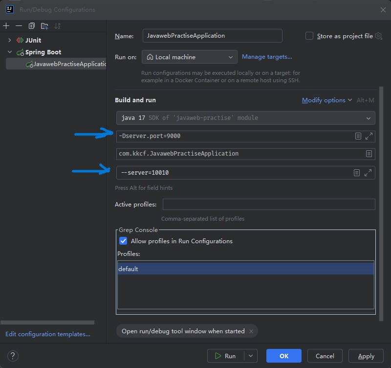

# IDEA 开发工具

IDEA 全称 IntelliJ IDEA，是用于 Java 语言开发的集成开发环境，它是业界公认的目前用于 Java 程序开发最好的工具。

- **集成环境**：表示把代码编写，编译，执行，调试等多种功能，综合到一起的开发工具。

## 一、IDEA 编写、编译、运行代码

IDEA 中，编写的 .java 文件，会自动保存和编译 。

要运行编写好的代码，有两种方式：

- 方式一：在空白处，右键 -> "Run Xxx.xxx()"；表示运行 Xxx 类的 xxx 方法。
- 方式二：在 Xxx 类名，或者 xxx 方法名这一行代码的行号出，点击运行按钮。

## 二、IDEA 设置 Java 系统属性、命令行参数

在 IDEA 中，运行程序，可配置项目的 Java 系统属性，命令行参数。

左上方点击要运行的方法 -> Edit Configurations -> Modify Options -> Add VM options 、Program arguments

