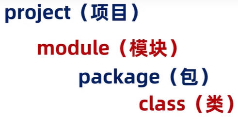

# IDEA 开发工具

IDEA 全称 IntelliJ IDEA，是用于 Java 语言开发的集成开发环境，它是业界公认的目前用于 Java 程序开发最好的工具。

- **集成环境**：表示把代码编写，编译，执行，调试等多种功能，综合到一起的开发工具。

## 一、IDEA Java 项目结构

IDEA Java 项目结构分为四类：

### 1.project（项目、工程）

project（项目、工程）是 IDEA 的最外层层级。它的下一层是 module（模块）。

### 2.module（模块）

在一个 project（项目、工程）中，可以存放多个模块，比如：

- 论坛模块；
- 报名、咨询模块。

为了更好的管理代码，项目中不同的业务功能代码，存放在不同的模块中。

### 3.package（包）

一个 module（模块）中又有很多的业务，以一个项目的论坛模块为例，至少包含了以下不同的业务。

- 发帖
- 评论

每一块业务，存放在一个 package（包）中。

### 4.class（类）

package（包）中存放了若干 class（类）。

class（类）是真正写代码的地方。



## 二、IDEA 创建一个空 Java 项目

### 1.project（项目、工程）创建

打开 IDEA 开发工具，创建一个 project（项目、工程）

1. 点击“New Project”；
2. 点击右侧“Empty Project”。
3. 为项目起名，并选择项目存放位置

### 2.module（模块）创建

为这个项目，创建一个 module（模块）

1. 点击左上角“File”，再点击“Project Structures”；
2. 在弹出的窗口右侧，选择“Modules”，点击窗口上方“+”号。再选择“New Modules”；
3. 选择左侧“JAVA”，表示新建一个 JAVA Module；并为 module（模块）起名。
4. 点击下方“OK”，创建 module（模块）。

#### 1.module（模块）导入

为这个项目，导入一个已存在的 module（模块）；

1. 点击左上角“File”，再点击“Project Structures”；
2. 在弹出的窗口右侧，选择“Modules”，点击窗口上方“+”号。再选择“Import Modules”；
3. 选择已有模块（Module）目录下的 `.iml` 配置文件。
4. 点击下方“OK”，导入 module（模块）。

#### 2.第三方（jar）包导入

1. 在 module 模块中，创建一个目录 `lib`，将第三方包 `xxx.jar` 放在该目录下。
2. 右键该第三方包，选择“Add as Library”。

### 3.package（包）创建

在模块中，新建一个 package（包），本质上就是一个文件夹（目录）：

1. 选中右侧菜单中 module（模块）下的 src 目录，右键 -> New -> Package。
2. 为 package（包）命名，习惯以公司域名的反写，加上 package（包）名来命名；
   - 比如：公司域名的反写是：`com.kkcf`；包名是 `demo01`；加起来就是 `com.kcf.demo01`；
   - 这个步骤，本质上是在 `src` 目录下，新建了一个 `com` 文件夹，在它下面又新建了一个 `kkcf` 文件夹，在它下面又新建了一个 `demo01` 文件夹；

### 4.class（类）创建

在 package（包）中，新建一个 class 类。

1. 在右侧项目目录结构中，选中刚刚创建的 package（包），右键 -> New -> Java Class；
2. 为 class（类）取名（注意遵守 class 类的命名规范）；
3. 选中“class”，回车。

#### 1.1interface（接口）创建

在 package（包）中，新建一个 interface 接口。

1. 在右侧项目目录结构中，选中刚刚创建的 package（包），右键 -> New -> Java Class；
2. 为 interface（接口）取名（注意遵守 class 类的命名规范）；
3. 选中“interface”，回车。

## 三、.IDEA 常用快捷操作

### 1.IDEA 默认代码片段

使用 `psvm` 迅速生成以下程序入口代码片段：

```java
public static void main(String[] args) {
}
```

使用 `sout` 迅速生成以下输出语句代码片段：

```java
System.out.println("");
```

使用 `souf` 迅速生成以下输出语句代码片段：

```java
System.out.printf("");
```

使用 `100.fori` 迅速生成循环次数为 100，条件控制语句递增的 for 循环语句。

```java
for (int i = 0; i < 100; i++) {
}
```

使用 `100.forr`  迅速生成循环次数为 100，条件控制语句递减的 for 循环语句。

```java
for (int i = 100; i > 0; i--) {
}
```

### 2.IDEA 插件

[ptg](https://plugins.jetbrains.com/plugin/13598-ptg) 插件，快速生成一个 JavaBean 类。

 [String Manipulation](https://plugins.jetbrains.com/plugin/2162-string-manipulation) 插件，可用于逐行递增数字，选中多行要递增的数字，Alt + M，increment/decrement，increment duplicate。

[any-rule](https://plugins.jetbrains.com/plugin/14162-any-rule) 插件，用于生成正则表达式。

## 四、.IDEA 编写、编译、运行代码

IDEA 中，编写的 .java 文件，会自动保存和编译 。

要运行编写好的代码，有两种方式：

- 方式一：在空白处，右键 -> "Run Xxx.xxx()"；表示运行 Xxx 类的 xxx 方法。
- 方式二：在 Xxx 类名，或者 xxx 方法名这一行代码的行号出，点击运行按钮。

## 五、IDEA 设置

### 1.进入 IDEA 的设置界面

1. 点击上方“File”，再点击“Settings”。

### 2.设置主题

1. 选择右侧“Appearance & Behavior”，再点击“Appearance”进行设置。

### 3.设置字体

1. 选择右侧“Editor” -> “Font”

### 4.设置自动导包

1. 选择右侧“Editor” -> “General” -> "Auto Import"
2. 勾选“Add umambiguous imports on the fly"和"Optimize imports on the fly"

### 5.设置代码提示忽略大小写

1. 选择右侧“Editor” -> “General” -> “Code Completion”；
2. 取消勾选“Math case”。

### 6.设置编辑工具的背景图片

1. 选择右侧“Appearance & Behavior” -> “Appearance” -> 点击“BackGround Image”；
2. 选中本地的一张图片，调整透明度即可。

### 7.设置项目单击打开文件、展开文件夹

1. 点击项目工作目录上方三个竖点（options），
2. 选择“Open File With Single Click”和“Open Directories With Single Click”

### 8.设置项目 JDK

1. 点击左上角“File”，再点击“Project Structures”；
2. 点击右侧“SDKs"，点击上方”+“号，再点击”Add JDK“。

#### 8.1 选择项目编译的 JDK

1. 点击左上角“File”，再点击“Project Structures”；
2. 选择右侧“Project"，再选择右侧“language level”中对应的版本。

### 9.设置光标处逐行递增

1. 安装插件 [String Manipulation](https://plugins.jetbrains.com/plugin/2162-string-manipulation)；
2. 多光标选中要改变的值。
3. 按下 Alt + m，选择 Increment/Decrement，选择 Create Squeece。

## 六、IDEA 类、模块、项目操作

### 1.IDEA class（类）的操作

我们知道，在项目中，每一个 .java 文件，就是一个 class 类。

**新建 class 类**；在 package（包）中，新建一个 class 类的步骤如下：

1. 在右侧项目目录结构中，选中刚刚创建的 package（包），右键 -> New -> Java Class；
2. 为 class（类）取名（注意遵守 class 类的命名规范）；
3. 选中“class”，回车。

**修改 class 类**；在 package（包）中，修改一个 class 类的类名，步骤如下：

1. 在右侧项目目录结构中，选中要修改的 .java 文件；
2. 右键 -> Refactor > Rename。
3. 输入修改的名称，回车。

**删除 class 类**；在 package（包）中，删除一个 class 类的步骤如下：

1. 在右侧项目目录结构中，选中要删除的 .java 文件，右键 -> delete。

### 2.IDEA module（模块）的操作

**新建 module 模块**；为这个项目，创建一个 module（模块）

1. 点击左上角“File”，再点击“Project Structures”；
2. 在弹出的窗口右侧，选择“Modules”，点击窗口上方“+”号。再选择“New Modules”；
3. 选择左侧“JAVA”，表示新建一个 JAVA Module；并为 module（模块）起名。
4. 点击下方“OK”，创建 module（模块）。

修改 module 模块

删除 module 模块

导入 module 模块

### 3.IDEA project（项目、工程）操作

**关闭 project 项目**；关闭当前打开的项目：

1. 点击左上角“File”，再点击“Close Project”；

**新建 project 项目**；打开 IDEA 开发工具，创建一个 project（项目、工程）

1. 点击“New Project”；
2. 点击右侧“Empty Project”。
3. 为项目起名，并选择项目存放位置。

打开项目

修改项目
